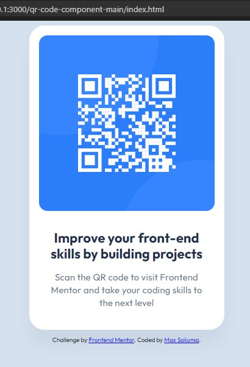

# Frontend Mentor - QR code component solution

This is a solution to the [QR code component challenge on Frontend Mentor](https://www.frontendmentor.io/challenges/qr-code-component-iux_sIO_H).
## Table of contents

- [Overview](#overview)
  - [Screenshot](#screenshot)
  - [Links](#links)
- [My process](#my-process)
  - [Built with](#built-with)
  - [What I learned](#what-i-learned)
  - [Continued development](#continued-development)
  - [Useful resources](#useful-resources)
- [Author](#author)
- [Acknowledgments](#acknowledgments)

## Overview

### Screenshot

### Links

- Solution URL: [My solution URL](https://github.com/msakuma-dev/QR-Code-Component-FrontendMentor/edit/main/qr-code-component-main/)

## My process

### Built with

- Semantic HTML5 markup (BEM Method)
- CSS custom properties
- Flexbox
- Mobile-first workflow

### What I learned

Checked Markdown Guide for the first time and now I know where to find the docs.

### Continued development

How to perfect CSS positioning, paddings and margins.
Also how to properly use em, rem, vh, instead of pixels as units.
Perfect usage of ARIA for cases like this.

### Useful resources

- [BEM Methodology](https://en.bem.info/methodology/) - This helped my to organize my work and make things reusable moving forward. 

## Author

- Linkedin - [Max Sakuma](https://www.linkedin.com/in/max-sakuma-5931004a/)
- Frontend Mentor - [@msakuma-dev](https://www.frontendmentor.io/profile/msakuma-dev)

## Acknowledgments

Big thanks for @knjshimi for being a great mentor and pointing me to the right direction.
